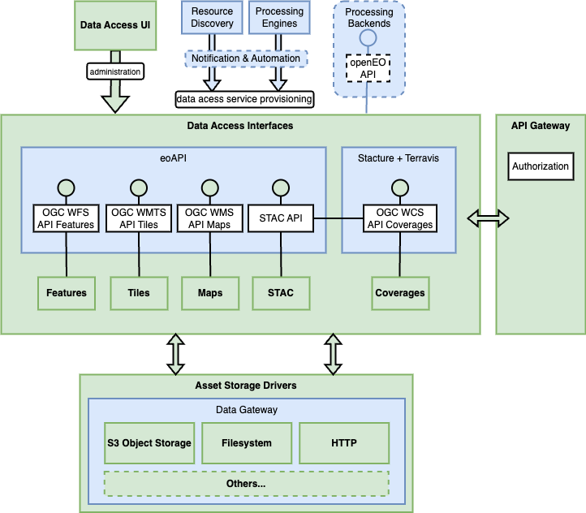

# Architecture

The architectural design of the data access building block is based on the software eoAPI and
[EOX View Server (Stacture and Terravis)](https://vs.pages.eox.at/stacture/),
providing the API endpoints and API functionalities.
The reason for this choice of libraries is documented [here](choice-of-libraries.md).

eoAPI includes the components tipg (vector data access) and titiler (raster data access). Tipg can be either
operated with a dedicated PostgreSQL/PostGIS database or connect to an existing pgstac database with
STAC collections and items. Titiler connects to the pgstac database from the resource discovery building
block. This allows to avoid metadata duplication and reduce the number of databases that need to be
maintained and operated. With this approach, the resource discovery (data catalog) and data access
building blocks use the same pgSTAC database.

For support of OGC API Coverages and OGC Web Coverage Service, components from View Server are
integrated into the building block, coupled with eoAPI via the STAC API and using the central STAC
database as their metadata backend.

To inform users which interfaces are available for any STAC collection in the catalog (e.g., OGC WCS,
OGC API Coverages, OGC WMS, OGC WMTS, OGC Tiles), this information is included in the STAC collection
metadata.

{: .centered}

The web-based administration interface is based on STAC Admin and EOxElements allowing to specify
which kind of data access services are enabled for which collections. All APIs are protected with the
Tyk-based API Gateway, which connects to the Identity Management building block for authentication and
authorization. In addition, Tyk is able to cache requests and conduct rate-limiting.
