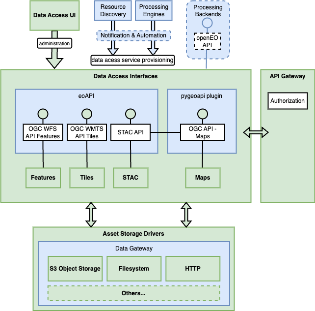

# Architecture

The Data Access building block provides essential services for performance-optimized storage
and distribution of metadata (Spatio Temporal Asset Catalog; STAC), raster data (imagery), vector data,
and multidimensional data (CF formats such as virtualized or native Zarr and NetCDF).

The services are provided by the software project [eoAPI](https://eoapi.dev/) and modular add-ons for
services that are not included in the main eoAPI suite.

eoAPI includes the components [STAC-FastAPI-PgSTAC](https://github.com/stac-utils/stac-fastapi-pgstac) 
(STAC storage with PgSTAC for Postgres and STAC API), [TiTiler-PgSTAC](https://github.com/stac-utils/titiler-pgstac),
[TiPg](https://github.com/developmentseed/tipg) (APIs for Features and vector tiles), and
[TiTiler-Multidim](https://github.com/developmentseed/titiler-multidim).

The full architecture is depicted below and is described programmatically in the [building block helm charts](https://github.com/EOEPCA/eoepca-plus/tree/deploy-develop/argocd/eoepca/data-access).

{: .centered}

The Data Access building block also connects to a web-based STAC data administation interface
based on [STAC Manager](https://github.com/developmentseed/stac-manager) that allows for small
manual edits of STAC collection and item information.

Ingress-based authentication and authorizatoin services as well as API gateway functions are added 
by integration with the IAM Building Block.