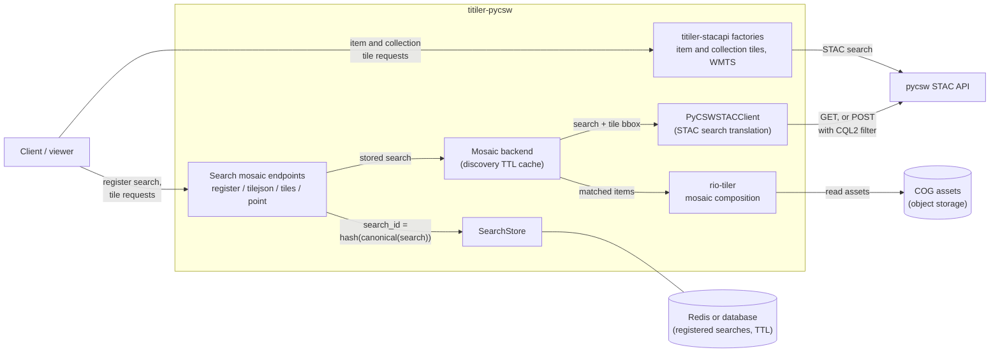

# titiler-pycsw

[pycsw](https://pycsw.org) is an OGC-compliant metadata catalog server with a [STAC API](https://docs.pycsw.org/en/latest/stac.html). titiler-pycsw connects [TiTiler](https://github.com/developmentseed/titiler) to a pycsw catalog so that data in the catalog can be visualised interactively, without a PgSTAC database. It serves map tiles for single STAC items, collection mosaics, and mosaics of arbitrary STAC searches.

<!-- TODO: add the repository URL once titiler-pycsw has its public home. -->

## Implementation in the EOEPCA Data Access Building Block

pycsw implements the STAC API specification, so item tiles and collection mosaics (including WMTS) already work through [titiler-stacapi](https://github.com/developmentseed/titiler-stacapi). What is missing in pycsw is search mosaics: a low-cloud-cover mosaic of optical imagery, radar scenes filtered by orbit direction, or any other STAC search rendered as a tile layer. A search should also be registerable, so a client can reference it by a stable ID.

We decided to implement titiler-pycsw as a titiler-stacapi extension, to make it easier to manage the release cadence. The extension adds a thin PyCSWSTACClient, which handles the translation between existing titiler code and a pycsw-backed API.

## Search mosaics

A search mosaic combines a stored STAC search (collections, datetime, a CQL2 filter, a sort order) with the tile footprint: each tile request runs the combined search against pycsw and composites the matching assets with [rio-tiler](https://github.com/cogeotiff/rio-tiler). A collection mosaic is just a search for a single collection, so one code path serves both.

As opposed to PgSTAC, which runs the mosaic query internally and stops as soon as a tile is covered, pycsw just provides a STAC search, so the tiler has to bound the work itself. We will implement an item limit per tile, and define a sort order with pixel selection so valid pixels come first. We will also add a TTL cache on search responses, and CQL2 filtering on the pycsw side to keep the candidate set small.

## Search registry

Registering a search returns its ID, which is a hash of the canonical search. Identical searches get the same ID. Tiles, TileJSON and point queries are served from `/searches/{search_id}/`.

The store backing the registry is modular and configurable: in-memory for local development, Redis or a database for production. Entries expire after some time, and a lost ID can be recovered by re-registering the same search, allowing the registry to behave as a cache. If permanent mosaic references are required, a database-backed store can be added without changing the interface.

## Conditions for the initial implementation

Search mosaics depend on the target pycsw deployment. These are the required conditions for a catalog to be supported by our POC:

1. CQL2 filtering on item properties. Desired properties must be supported as queryables and filterable on the search endpoint. Without this, filtering happens in the tiler and the per-tile bounds above lose most of their value.
2. `sortby` on the search endpoint, including on those same properties.
3. Search by bounding box. This is the default; a config flag enables POST intersects queries where the deployment supports them.
4. Assets that point at readable, service-accessible data. Records must map to STAC items whose asset hrefs reference COGs or other rasterio-readable sources.

<!-- Local tests against pycsw with sample items and collections confirmed that these are all generally supported. -->